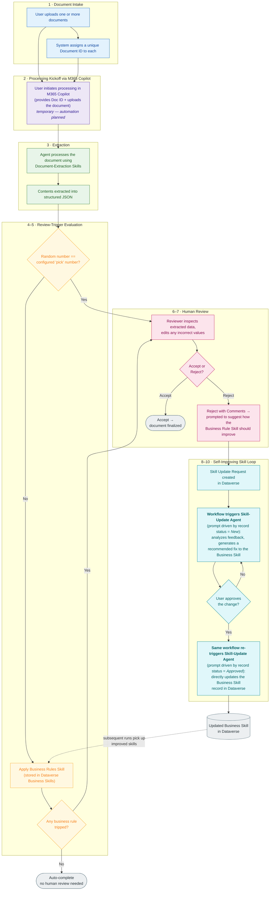

# HITL Skill Improvement — Document Intake & Human-in-the-Loop Review

A Power Apps **Code App** (React + TypeScript + Vite + Fluent UI v9) that demonstrates a
**closed feedback loop where human reviewers continuously improve an AI agent's skills.**

People upload documents (receipts, invoices, …). An external AI agent reads each file and
extracts structured data. A configurable share of records is routed to a human reviewer. When a
reviewer rejects an extraction, they describe what the agent should have done differently — and
that feedback is turned into an edit to the **live agent skill**, so the agent gets better the
next time it runs. That loop is the whole point of this repo: **humans in the loop don't just
correct data, they upgrade the AI.**

> **This is a Power Platform Code App**, not a standalone web app. It is bundled with Vite,
> authenticated by Microsoft Entra ID through the Power Platform host, deployed with
> `pac code push`, and bound to **Dataverse** tables. See [AGENTS.md](AGENTS.md) for the
> architectural contract.

---

## What problem this solves

Document-extraction agents are never perfect. The usual answer is to have a human fix the
output. That fixes *one* record but loses the lesson. This solution captures the lesson:

1. A reviewer rejects a bad extraction and writes a plain-language **Suggested Fix** ("flag
   invoices over $5,000", "treat coffee shops as restaurants", …).
2. An agent reads that suggestion in the context of the skill's *current* rules and **proposes a
   concrete edit** to the skill.
3. A reviewer approves it, and an agent **applies the edit to the live business skill** in
   Dataverse.
4. The next document the extraction/flagging agents process already follows the improved rule.

The app is the human side of that loop. The agent skills (under [`agent/`](agent/)) are the AI
side.

---

## End-to-end flow

```
            ┌─────────────────────── THE APP (this repo, Code App) ───────────────────────┐
 Uploader   │  Upload file ─► store Source File ─► random draw ─► Processing Status=Queued │
            └───────────────────────────────────────┬───────────────────────────────────┘
                                                     │ (external flow watches for "Queued")
            ┌──────── EXTERNAL: Power Automate flow + AI agent (agent/ skills) ───────────┐
            │  document-extraction:  read file ─► extract JSON ─► classify Document Type   │
            │                        ─► write back Extracted Data + Status = Processed     │
            │  review-flagging:      apply business rules (invoice ≥ $2,500, restaurant    │
            │                        receipt) ─► raise review flag when a rule matches     │
            └───────────────────────────────────────┬───────────────────────────────────┘
                                                     │
            ┌─────────────────────── THE APP — human review loop ────────────────────────┐
 Reviewer   │  Review Queue ─► view file + correct Extracted Data (Dynamic Field Editor)  │
            │  Approve ── or ── Reject (describe what the agent should do better)          │
            │                              ─► raises a Skill Update Request                │
            └───────────────────────────────────────┬───────────────────────────────────┘
                                                     │
            ┌──────── AGENT: review-skill-editor (closes the loop) ──────────────────────┐
            │  recommend-skill-update:  read Suggested Fix + current skill ─► propose an  │
            │                           edit ─► save Agent Recommendation on the request  │
            │  review-skill-editor:     on reviewer approval ─► apply the edit to the     │
            │                           live `review-flagging` business skill ─► Completed │
            └───────────────────────────────────────┬───────────────────────────────────┘
                                                     │
                                  next run follows the improved rule ↺
```

### Workflow diagram

The same loop, step by step — from upload through extraction, the two review triggers, and the
self-improving skill-update cycle that feeds back into future runs.



> **Steps 8 and 10 are the same Power Automate workflow invoking the same Skill-Update Agent.**
> The workflow fires on changes to the Skill Update Request record and selects the agent's prompt
> based on the record's **status**: a *New* request prompts the agent to **recommend** a fix; an
> *Approved* request prompts it to **apply** the fix to the live Business Skill.

**The app deliberately does *not* read or extract document content.** It owns upload, the random
review draw, the dynamic editor, the review loop, and the skill-update request lifecycle. The
extraction agent, the flagging rules, and the Power Automate flow that orchestrates them are
external — the app hands off by setting `Processing Status = Queued` and consumes whatever the
agent writes back.

---

## The two halves of this repo

| Half | Lives in | Responsibility |
|---|---|---|
| **The Code App** | [`src/`](src/) | Upload, random review draw, dynamic field editor, the human review loop, and the Skill Update Request lifecycle UI. Bound to Dataverse. |
| **The agent skills** | [`agent/`](agent/) | Natural-language **business skills** that AI agents discover and follow at runtime, driving the Dataverse MCP server. |

### Agent skills (`agent/`)

| Skill | What it does |
|---|---|
| [`document-extraction`](agent/document-extraction/SKILL.md) | Reads a document's stored file, extracts JSON, classifies the Document Type, writes it back, and manages `Processing → Processed / Failed`. Then chains into review-flagging. |
| [`review-flagging`](agent/review-flagging/SKILL.md) | The **policy** that decides if a processed document needs human review (e.g. *Invoice total ≥ $2,500*, *Receipt looks like a restaurant*). This is the skill the feedback loop edits. |
| [`review-skill-editor`](agent/review-skill-editor/SKILL.md) | Reads reviewer **Skill Update Requests** and updates the `review-flagging` skill accordingly. A "recommend" step ([`recommend-skill-update`](agent/review-skill-editor/recommend-skill-update.SKILL.md)) drafts an edit and saves it onto the request; an "apply" step writes the approved edit to the live skill. |

---

## Data model (Dataverse)

Four user-owned tables in the **HITL Skill Update** solution (publisher prefix `msfthitl_`). See
[`dataverse/planning-payload.json`](dataverse/planning-payload.json) for the exact schema and
[`CONTEXT.md`](CONTEXT.md) for the business glossary.

### `Document` — the central record

One uploaded file plus everything the system knows about it.

| Column | Type | Set by | Notes |
|---|---|---|---|
| Document Name | Text (primary) | App | Defaults to the uploaded file name. |
| Document Number | AutoNumber | Dataverse | `DOC-2026-00001`; how agents reference the record. |
| Source File | **File** | App | The original PDF/JPG/PNG (≈32 MB cap). |
| Document Type | Lookup → Document Type | **Agent** | Empty at upload; classified during processing. |
| Processing Status | Choice | App → flow/agent | `Uploaded → Queued → Processing → Processed → Failed`. App sets `Queued`. |
| Extracted Data | Memo (JSON, ≤1 MB) | **Agent** ↔ Reviewer | Variable, schema-less JSON. Edited via the Dynamic Field Editor — **never shown as raw JSON**. |
| Random Draw Value | Whole number | App | The integer drawn at create, captured for audit. |
| Flagged For Review | Yes/No | App / Agent | True when the draw hits the Trigger Value, or a flagging rule matches. |
| Review Status | Choice | App | `Not Required → Pending Review → In Review → Approved → Rejected`. |
| Review Comment / Processing Error | Memo | Reviewer / flow | Comment required on reject; error set on `Failed`. |
| Processed On / Reviewed On | DateTime | Agent / Reviewer | Timestamps. |

### `Document Type`
Admin-managed catalog of categories (Receipt, Invoice, …) — extensible without a code change.
Columns: Type Name, Description, Is Active.

### `Review Settings` (single row)
Controls the random sampling draw. `Range Min`, `Range Max`, `Trigger Value` — edited in-app on
the Admin Settings screen. On every upload the app draws an integer in `[Min, Max]`; if it equals
`Trigger Value`, the document is flagged for human review.

### `Skill Update Request` — the feedback record
Raised when a reviewer rejects a document. This is the bridge from the app to the agent skills.

| Column | Type | Notes |
|---|---|---|
| Skill Update Number | AutoNumber | `SUR-2026-00001`. |
| Document | Lookup → Document | The rejected document that triggered it. |
| Suggested Fix | Memo | The reviewer's plain-language description of what the agent should do better. |
| Agent Recommendation | Memo (≤100 KB) | The agent's concrete proposed edit to the skill, generated from the Suggested Fix. |
| Skill Update Status | Choice | `New → In Progress → Completed / Dismissed`; **Approved — Implement** is the reviewer's go-ahead for the agent to apply the recommendation. |
| Requested On / Resolved On | DateTime | Lifecycle timestamps. |

### Option sets
`Processing Status`, `Review Status`, `Skill Update Status` (integer base `720670000`).

### Roles
Three Dataverse security roles — **Uploader / Reviewer / Admin**. All tables are user/team owned;
data visibility is delegated entirely to Dataverse security modeling, not modeled in app code.

---

## Screens

| Screen | Audience | Purpose |
|---|---|---|
| **Dashboard** | All | Counts by processing status, review backlog, recent uploads. |
| **Documents** | Uploader | List + filters + **Upload** (runs the random draw, sets `Queued`). |
| **Document Detail** | All | Source File viewer + status + Dynamic Field Editor (read-only unless reviewing). |
| **Review Queue / Workspace** | Reviewer | Flagged + processed + pending documents; correct data, Approve, or Reject. Failed docs appear with a distinct reason and offer Re-queue. |
| **Skill Updates** | Reviewer / Admin | The feedback lifecycle — lists Skill Update Requests, shows the agent's recommendation, and tracks `New → In Progress → Completed / Dismissed`. |
| **Admin Settings** | Admin | Edit Review Settings and manage Document Types. |

### The Dynamic Field Editor
The centerpiece component ([`src/components/DynamicFieldEditor.tsx`](src/components/DynamicFieldEditor.tsx)).
Because each document type produces a different JSON shape, the editor **infers Fluent UI
controls from the JSON value shapes** — strings → inputs, dates → date pickers, numbers → numeric
inputs, booleans → switches, arrays of objects → editable tables, nested objects → collapsible
sections — and writes edits back into the JSON. The raw JSON is never displayed. During review it
can highlight fields a reviewer changed against the original extraction.

---

## Architecture

Three-layer, mock-first ([AGENTS.md](AGENTS.md) rules apply):

- **Components** render, **hooks** orchestrate, **services/providers** expose a single data
  contract ([`src/services/data-contracts.ts`](src/services/data-contracts.ts)).
- A **mock provider** and a **real (Dataverse) provider** implement the same contract; a factory
  switches between them via `VITE_USE_MOCK`. The whole app was built and validated on mock data
  before any Dataverse table existed.
- [`src/generated/`](src/generated/) is produced by `pac code add-data-source` and is
  **read-only** — wrapped behind adapters in the real provider, never edited or called directly
  from components.
- **HashRouter** (not BrowserRouter), Vite port **3000** for local dev, relative asset base for
  production — required by the Power Apps host.
- Dataverse-bound form fields use the **`DataverseFieldLabel`** metadata pattern so required
  indicators track each column's `RequiredLevel`.

---

## Project setup

| Property | Value |
|---|---|
| Solution | HITL Skill Update (`HITLSkillUpdate`) |
| Publisher / prefix | HITL / `msfthitl` |
| Choice-value base | `720670000` |
| Dev environment | https://carremacodeapps.crm.dynamics.com |

---

## Develop

```bash
npm install
npm run dev:local      # run against the mock provider (VITE_USE_MOCK=true), no Dataverse needed
npm run prototype:seed # (optional) seed helper from the planning payload
npm run dev            # run against the live environment (vite + pac code run)
```

```bash
npm run test           # vitest unit/component tests
npm run test:e2e       # Playwright smoke tests
npm run typecheck
npm run lint
```

## Build and deploy

```bash
npm run build
pac code push -s "HITLSkillUpdate"
```

The production build runs on the **real** Dataverse provider (`VITE_USE_MOCK=false` in
`.env.production`), while tests and `npm run dev:local` stay on mock data.

---

## Where to read more

- [AGENTS.md](AGENTS.md) — the Code App architectural contract every agent must follow.
- [CONTEXT.md](CONTEXT.md) — the business glossary (canonical vocabulary).
- [docs/build-plan.md](docs/build-plan.md) — the full, phase-by-phase build plan and status.
- [docs/adr/](docs/adr/) — the locked architectural decisions (file-column storage, in-app draw,
  JSON-in-Dataverse, inferred forms, rejection-raises-skill-update).
- [dataverse/planning-payload.json](dataverse/planning-payload.json) — the source-of-truth schema.
- [agent/](agent/) — the AI agent skills that extract, flag, and self-improve.
